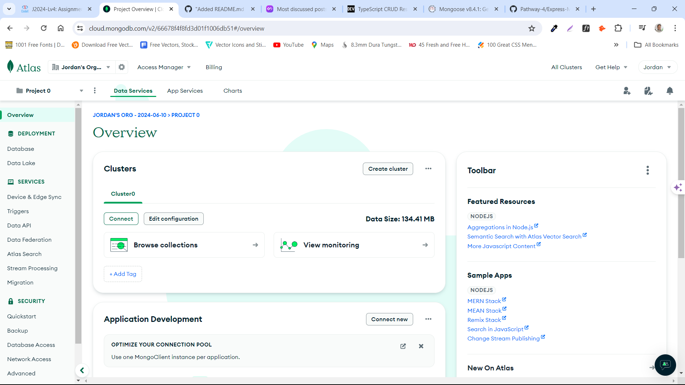
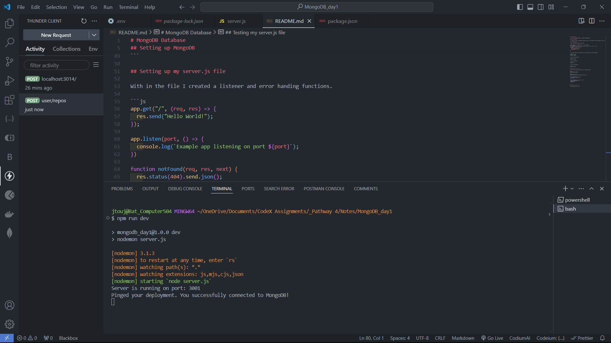

# MongoDB Database

This is a simple MongoDB database. I connected to MongoDB Atlas.

## Setting up MongoDB

1. I created an account in MongoDB then created a cluster. I then created a user and a password for that user.



2. Then I accessed my database to my VS code.

```js
const { MongoClient, ServerApiVersion } = require("mongodb");
const uri = DB;
// Create a MongoClient with a MongoClientOptions object to set the Stable API version
const client = new MongoClient(uri, {
  serverApi: {
    version: ServerApiVersion.v1,
    strict: true,
    deprecationErrors: true,
  },
});
```

3. I installed express.js and nodemon to help run the software and access the database.

```bash
npm install express
npm install nodemon
```

4. I then installed mongodb.

```bash
npm install mongodb
```

5. I then installed cors.

```bash
npm install cors
```

6. I then installed dotenv.

```bash
npm install dotenv
```

## Setting up my server.js file

With in the file I created a listener and error handing functions.

```js
app.get("/", (req, res) => {
  res.send("Hello World!");
});

app.listen(port, () => {
  console.log(`Example app listening on port ${port}`);
});

function notFound(req, res, next) {
  res.status(404).send.json();
  next(error);
}

function errorHandler(err, req, res, next) {
  res.status(500).send.json();
  console.log(err);
  next(err);
}
```

## Testing my server.js file

I then tested my server.js file.



This image shows that the connection to the database was a success.
